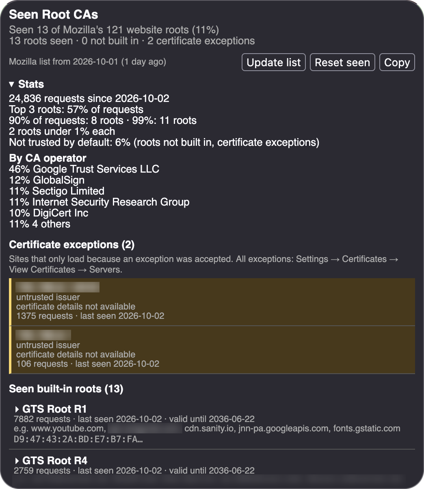

#  Root CA Tracker

A Firefox extension that records which root certificate authorities your
HTTPS connections actually chain to, and compares them with the roots Mozilla
ships. Firefox trusts around 120 roots for websites; most people only ever use
a handful. Knowing which ones is the first step to trimming the rest.

## What it shows



- **Stats**: total requests, how many roots cover 90% and 99% of them, the
  share not trusted by default, and requests by CA operator.
- **Seen roots** with request counts, first/last seen, expiry and recent hosts.
- **Roots that aren't built into Firefox**, highlighted. These are installed by
  you or by software (corporate proxies, antivirus, dev tools) and can mean
  your HTTPS traffic is being inspected.
- **Certificate exceptions**: hosts that only load because you accepted a
  certificate warning.
- **Never-seen roots** from Mozilla's list, grouped like Firefox's Certificate
  Manager, and "seen Y of X website roots".

## Privacy

Everything stays in the extension's local storage. The extension makes exactly
one kind of network request, and only when you click **Update list**: it
downloads Mozilla's public root list from [CCADB](https://www.ccadb.org/).
A copy of that list is bundled, so the button is optional.

## Install

From [addons.mozilla.org](https://addons.mozilla.org/firefox/addon/root-ca-tracker/),
or for development: `about:debugging` → This Firefox → Load Temporary Add-on →
select `manifest.json`.

Works in Firefox 140+ and Firefox-based browsers such as LibreWolf. It relies on
Firefox-only APIs (`webRequest.getSecurityInfo`), so there is no Chrome version.

## Development

All targets run in Docker, so nothing needs to be installed on the host:

```sh
make build   # syntax check, lint, then package web-ext-artifacts/root_ca_tracker-<version>.zip
make lint    # Mozilla's validator, the same checks AMO runs on upload
make roots   # refresh the bundled mozilla-roots.json from CCADB
```

Targets use the `node:22` image by default. To use another image, create a
`local.mk` with `DOCKER_IMAGE := <image>` (it's git-ignored).

## License

MIT, see [LICENSE](LICENSE).
